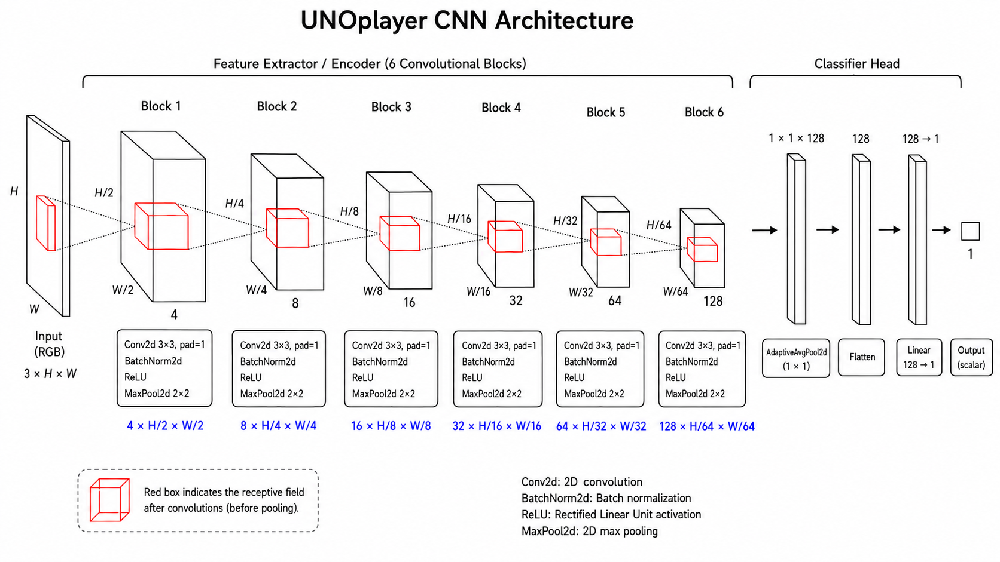

# UNO active player detection

-----------

This repository stores the code used for training, validating, and testing a convolutional neural network (CNN) for predicting the active player in the card game UNO from images.

The CNN model was developed for the special project of the Master's course [**EE-451: Image analysis and pattern recognition**](https://edu.epfl.ch/coursebook/en/image-analysis-and-pattern-recognition-EE-451), academic year 2025-2026 (spring semester).
\
Besides common deep learning standards (the testing dataset must not be used for training or fine-tuning the model, nor for augmentation of the training dataset), the following rules applied:

1. external dataset could not be used at any stage of the project;
2. pre-trained models could not be used, any deep learning model must be trained from scratch;
3. deep learning models could not exceed 12 million parameters.

The training and testing datasets cannot be shared as part of the Kaggle competition agreement.
\
Only the reference images and a few testing images are added in the notebook for visualization purposes.

The model achieved a 100% accuracy on the test dataset, showing strong predictive skills. The inclusion of dataset augmentation improved the test validation accuracy from 0.78 to 1.00.

-----------

The repository is organized as follows:

- `data`, contains reference images. The training and testing datasets cannot be shared as intellectual property of the teaching team;
- `model`, contains the code of the CNN architecture;
- `outputs`, contains the training and testing outputs (training and validation losses, model state dictionary, traing dataset normalization parameters, test predictions);
- `postprocessing`, contains modules for plotting figures and storing model outputs;
- `preprocessing`, contains modules for the model training and testing.

-----------
The model architecture is presented in the next image:

